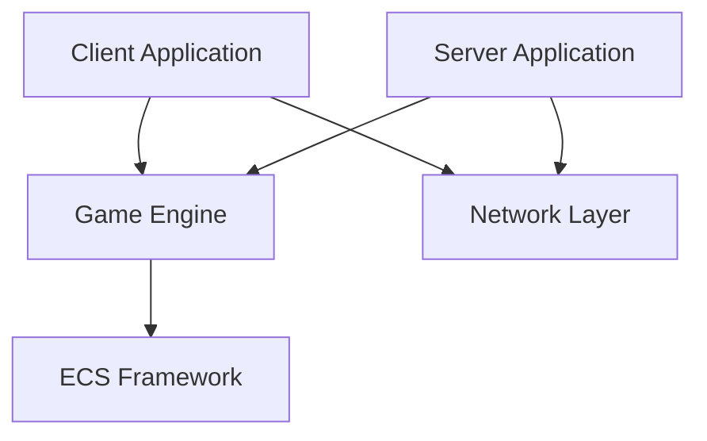

# Architecture Overview

R-TYPE is built with a modern, modular architecture focusing on performance and maintainability.

## High-Level Architecture



## Core Components

### 1. Game Engine

The core engine provides fundamental game functionality:

- **Rendering System** - Graphics and display management
- **Input System** - Keyboard, mouse, and controller input
- **Audio System** - Sound effects and music
- **Resource Manager** - Asset loading and caching
- **Scene Manager** - Game state and scene transitions

### 2. Entity Component System (ECS)

R-TYPE uses a custom ECS architecture for game logic:

```
Entity: Unique ID representing a game object
Component: Pure data (Position, Velocity, Sprite, etc.)
System: Logic that operates on entities with specific components
```

**Benefits:**
- ✅ Data-oriented design
- ✅ Cache-friendly
- ✅ Highly composable
- ✅ Easy to extend

Learn more: [ECS Deep Dive](ecs.md)

### 3. Network Layer

UDP-based networking for real-time multiplayer:

- **Client-Server Architecture**
- **State Synchronization**
- **Lag Compensation**
- **Packet Compression**

Learn more: [Network Architecture](network.md)

## Project Structure

```
R-TYPE/
├── client/                 # Client application
│   ├── src/
│   │   └── main.cpp       # Client game loop with SFML rendering
│   └── CMakeLists.txt
│
├── server/                 # Server application  
│   ├── src/
│   │   └── main.cpp       # Server (planned for multiplayer)
│   └── CMakeLists.txt
│
├── engine/                 # Core ECS framework
│   └── ecs/               # ECS implementation
│       ├── entity.hpp     # Entity ID wrapper
│       ├── registry.hpp   # Component coordinator
│       ├── sparse_array.hpp  # Component storage
│       ├── components.hpp # Base components (position, velocity, etc.)
│       ├── zipper.hpp     # Multi-component iteration
│       └── zipper_iterator.hpp
│
├── game/                   # Game logic library
│   ├── include/
│   │   ├── components/    # Game-specific components
│   │   │   └── game_components.hpp  # health, sprite, animation, etc.
│   │   ├── entities/      # Entity factories
│   │   │   ├── player_factory.hpp
│   │   │   ├── enemy_factory.hpp
│   │   │   ├── projectile_factory.hpp
│   │   │   └── explosion_factory.hpp
│   │   └── systems/       # Game systems
│   │       ├── input_system.hpp
│   │       ├── movement_system.hpp
│   │       ├── shooting_system.hpp
│   │       ├── collision_system.hpp
│   │       └── cleanup_system.hpp
│   ├── src/               # Implementation files
│   │   ├── components/
│   │   ├── entities/
│   │   └── systems/
│   └── CMakeLists.txt
│
├── bootstrap/              # Legacy ECS demos (not used in main build)
│   └── bs/                # Standalone ECS examples
│
├── tests/                  # Test suites
│   ├── bootstrap/         # ECS unit tests
│   ├── ecs/               # Engine tests
│   ├── game/              # Game logic tests
│   ├── network/           # Network tests (planned)
│   └── integration/       # Integration tests
│
├── assets/                 # Game assets
│   ├── r-typesheet1.png   # Player, projectiles, explosions
│   ├── r-typesheet26.png  # Enemy sprites
│   ├── bg.png             # Scrolling background
│   └── fonts/
│
└── third_party/            # External dependencies (via Conan)
```

## Data Flow

### Current Game Loop (Singleplayer Client)

```
┌─────────────────────────────────────────┐
│     Singleplayer Client Game Loop       │
│                                         │
│  1. Poll SFML Events (ESC to quit)      │
│  2. Process Input (WASD movement)       │
│  3. Update Shooting System              │
│  4. Update Movement System              │
│  5. Update Collision Detection          │
│  6. Update Explosion Lifetimes          │
│  7. Cleanup Dead Entities               │
│  8. Update Sprite Animations            │
│  9. Render Background (scrolling)       │
│ 10. Render All Entities (sprites)       │
│ 11. Render UI (health bar)              │
│ 12. Display Frame (60 FPS)              │
└─────────────────────────────────────────┘
```

### Planned Multiplayer Game Loop (Future)

**Client:**
```
┌─────────────────────────────────────────┐
│           Client Game Loop              │
│                                         │
│  1. Process Input                       │
│  2. Send Input to Server (UDP)          │
│  3. Receive Server Updates              │
│  4. Interpolate/Predict State           │
│  5. Update Local ECS Systems            │
│  6. Render Frame                        │
│  7. Handle Audio                        │
└─────────────────────────────────────────┘
```

**Server:**
```
┌─────────────────────────────────────────┐
│           Server Game Loop              │
│                                         │
│  1. Receive Client Inputs (UDP)         │
│  2. Validate Inputs                     │
│  3. Update ECS Systems                  │
│  4. Run Game Logic                      │
│  5. Detect Collisions                   │
│  6. Serialize State                     │
│  7. Broadcast to Clients                │
└─────────────────────────────────────────┘
```

## Key Design Patterns

### Component Pattern

Pure data structures without logic:

```cpp
struct Position {
    float x;
    float y;
};

struct Velocity {
    float dx;
    float dy;
};
```

### System Pattern

Logic that processes entities:

```cpp
class MovementSystem {
public:
    void update(Registry& registry, float deltaTime) {
        auto& positions = registry.get_components<Position>();
        auto& velocities = registry.get_components<Velocity>();
        
        for (size_t i = 0; i < positions.size(); ++i) {
            if (positions[i] && velocities[i]) {
                positions[i]->x += velocities[i]->dx * deltaTime;
                positions[i]->y += velocities[i]->dy * deltaTime;
            }
        }
    }
};
```

### Registry Pattern

Central entity and component management:

```cpp
Registry registry;

// Create entity
Entity player = registry.spawn_entity();

// Add components
registry.add_component(player, Position{100.0f, 100.0f});
registry.add_component(player, Velocity{50.0f, 0.0f});
registry.add_component(player, Sprite{"player.png"});
```

## Performance Considerations

### Memory Layout

Components are stored in `SparseArray` for:
- ✅ Cache-friendly iteration
- ✅ O(1) component lookup
- ✅ Automatic memory management

### Network Optimization

- **Delta Compression** - Send only changes
- **State Snapshots** - Periodic full state sync
- **Priority System** - Important entities updated more frequently
- **Dead Reckoning** - Client-side prediction

## Threading Model

```
Main Thread:       Game Loop, Rendering
Network Thread:    Send/Receive Packets
Audio Thread:      Sound Processing
Loading Thread:    Asset Streaming
```

## Dependencies

### External Libraries (via Conan)

- **SFML 2.6.1** - Graphics, window, input, audio
- **Asio 1.30.2** - Async networking (for future multiplayer)
- **GTest 1.14.0** - Unit testing framework

### Build Tools

- **CMake 3.20+** - Build system
- **Conan 2.x** - Package manager
- **clang-format** - Code formatting
- **clang-tidy** - Static analysis

All core functionality is implemented in-house for maximum control and learning.

## Next Steps

- 📖 [ECS System](ecs.md) - Deep dive into the Entity Component System
- 🌐 [Network Architecture](network.md) - How multiplayer works
- ⚙️ [Game Engine](engine.md) - Engine internals

## Design Principles

!!! info "SOLID Principles"
    The codebase follows SOLID principles for maintainability and extensibility.

!!! tip "Data-Oriented Design"
    We prioritize cache efficiency and data locality for performance.

!!! warning "Minimal Dependencies"
    We keep external dependencies minimal to reduce complexity.
