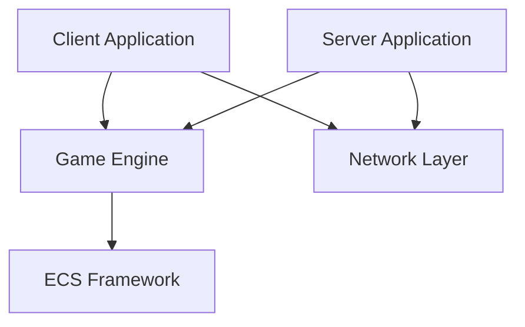

# Architecture Overview

R-TYPE is built with a modern, modular architecture focusing on performance and maintainability.

## High-Level Architecture



## Core Components

### 1. Game Engine

The core engine provides fundamental game functionality:

- **Rendering System** - Graphics and display management
- **Input System** - Keyboard, mouse, and controller input
- **Audio System** - Sound effects and music
- **Resource Manager** - Asset loading and caching
- **Scene Manager** - Game state and scene transitions

### 2. Entity Component System (ECS)

R-TYPE uses a custom ECS architecture for game logic:

```
Entity: Unique ID representing a game object
Component: Pure data (Position, Velocity, Sprite, etc.)
System: Logic that operates on entities with specific components
```

**Benefits:**
- ✅ Data-oriented design
- ✅ Cache-friendly
- ✅ Highly composable
- ✅ Easy to extend

Learn more: [ECS Deep Dive](ecs.md)

### 3. Network Layer

UDP-based networking for real-time multiplayer:

- **Client-Server Architecture**
- **State Synchronization**
- **Lag Compensation**
- **Packet Compression**

Learn more: [Network Architecture](network.md)

### UDP Server (network thread)

The network server now uses a dual-loop architecture: the game loop executes game logic while a separate network loop handles UDP I/O (ASIO) and packet sending. This separates deterministic game processing from asynchronous I/O operations.

- Asynchronous packet reception via ASIO
- Client registration and tracking (map id -> endpoint)
- Thread-safe input queue (input_queue_) for the game loop
- Thread-safe output queue (output_queue_) for sending responses
- Output processing: targeted unicast sending to the sender's endpoint via `send_to_endpoint()` — global broadcast is no longer the default
- `stop()` method available for cleanly shutting down the network loop

Simplified API (extract):

```cpp
class UDPServer {
public:
    UDPServer(asio::io_context& io, unsigned short port);
    ~UDPServer();

    bool get_input_packet(NetworkPacket& packet);
    void queue_output_packet(const NetworkPacket& packet);
    void process_output_queue(); // sends unicast to packet.sender
    void send_to_endpoint(const asio::ip::udp::endpoint& ep, const std::vector<uint8_t>& data);
    void send_to_client(int client_id, const std::vector<uint8_t>& data);
    void stop();
};
```

Implications:

- Game logic responses must be packaged in `NetworkPacket` including the recipient's `endpoint` (`packet.sender`) or client ID.
- The network loop handles actual sending (calls to `socket_.async_send_to`); the game loop performs no blocking network operations.


## Project Structure

```
R-TYPE/
├── client/                 # Client-specific code
│   ├── src/
│   │   ├── main.cpp
│   │   ├── game/          # Game logic
│   │   ├── rendering/     # Rendering system
│   │   └── ui/            # User interface
│   └── include/
│
├── server/                 # Server-specific code
│   ├── src/
│   │   ├── main.cpp
│   │   ├── game/          # Server game logic
│   │   └── network/       # Network handling
│   └── include/
│
├── engine/                 # Shared game engine
│   ├── src/
│   │   ├── ecs/           # ECS implementation
│   │   ├── physics/       # Physics system
│   │   ├── rendering/     # Rendering core
│   │   └── utils/         # Utilities
│   └── include/
│
├── bootstrap/              # ECS bootstrap
│   └── bs/                # ECS framework
│       ├── entity.hpp
│       ├── registry.hpp
│       ├── sparse_array.hpp
│       ├── components.hpp
│       └── systems.hpp
│
├── tests/                  # Test suites
│   ├── unit/
│   ├── integration/
│   └── benchmark/
│
└── third_party/            # External dependencies
```

## Data Flow

### Game Loop (Client)

```
┌─────────────────────────────────────────┐
│           Client Game Loop              │
│                                         │
│  1. Process Input                       │
│  2. Update ECS Systems                  │
│  3. Send Input to Server                │
│  4. Receive Server Updates              │
│  5. Interpolate/Predict                 │
│  6. Render Frame                        │
│  7. Handle Audio                        │
└─────────────────────────────────────────┘
```

### Game Loop (Server)

```
┌─────────────────────────────────────────┐
│           Server Game Loop              │
│                                         │
│  1. Receive Client Inputs               │
│  2. Validate Inputs                     │
│  3. Update ECS Systems                  │
│  4. Run Game Logic                      │
│  5. Detect Collisions                   │
│  6. Serialize State                     │
│  7. Enqueue responses to clients        │
│     (unicast/targeted)                  │
└─────────────────────────────────────────┘
```

## Key Design Patterns

### Component Pattern

Pure data structures without logic:

```cpp
struct Position {
    float x;
    float y;
};

struct Velocity {
    float dx;
    float dy;
};
```

### System Pattern

Logic that processes entities:

```cpp
class MovementSystem {
public:
    void update(Registry& registry, float deltaTime) {
        auto& positions = registry.get_components<Position>();
        auto& velocities = registry.get_components<Velocity>();
        
        for (size_t i = 0; i < positions.size(); ++i) {
            if (positions[i] && velocities[i]) {
                positions[i]->x += velocities[i]->dx * deltaTime;
                positions[i]->y += velocities[i]->dy * deltaTime;
            }
        }
    }
};
```

### Registry Pattern

Central entity and component management:

```cpp
Registry registry;

// Create entity
Entity player = registry.spawn_entity();

// Add components
registry.add_component(player, Position{100.0f, 100.0f});
registry.add_component(player, Velocity{50.0f, 0.0f});
registry.add_component(player, Sprite{"player.png"});
```

## Performance Considerations

### Memory Layout

Components are stored in `SparseArray` for:
- ✅ Cache-friendly iteration
- ✅ O(1) component lookup
- ✅ Automatic memory management

### Network Optimization

- **Delta Compression** - Send only changes
- **State Snapshots** - Periodic full state sync
- **Priority System** - Important entities updated more frequently
- **Dead Reckoning** - Client-side prediction

## Threading Model

```
Main Thread:       Game Loop, Rendering
Network Thread:    ASIO I/O (poll) + output queue processing
Audio Thread:      Sound Processing
Loading Thread:    Asset Streaming
```

## Dependencies

### External Libraries

- **SFML** - Graphics, window, input (optional)
- **Boost.Asio** - Networking (alternative)
- **JSON** - Configuration files
- **Google Test** - Unit testing

### Internal Libraries

All core functionality is implemented in-house for maximum control and learning.

## Next Steps

- 📖 [ECS System](ecs.md) - Deep dive into the Entity Component System
- 🌐 [Network Architecture](network.md) - How multiplayer works
- ⚙️ [Game Engine](engine.md) - Engine internals

## Design Principles

!!! info "SOLID Principles"
    The codebase follows SOLID principles for maintainability and extensibility.

!!! tip "Data-Oriented Design"
    We prioritize cache efficiency and data locality for performance.

!!! warning "Minimal Dependencies"
    We keep external dependencies minimal to reduce complexity.
