# Architecture Overview

R-TYPE is built with a modern, modular architecture focusing on separation of concerns, performance, and maintainability. The project has been extensively refactored to eliminate "God Objects" and implement clean design patterns.

##  High-Level Architecture

```mermaid
graph TB
    Client[Client Application]
    Server[Server Application]
    Engine[Game Engine]
    GameLib[Game Library]
    
    subgraph "Client Components"
        States[State Manager]
        Managers[Resource Managers]
        Renderers[Rendering System]
        Input[Input Handler]
        ClientNet[Network Client]
    end
    
    subgraph "Server Components"
        GameSession[Game Session]
        Handlers[Request Handlers]
        ServerManagers[Game Managers]
        Broadcasters[Network Broadcasters]
        ServerNet[UDP Server]
    end
    
    subgraph "Engine Core"
        ECS[ECS Framework]
        Audio[Audio System]
        Render[Render System]
        Net[Network Layer]
        Utils[Utilities]
    end
    
    Client --> States
    Client --> Managers
    Client --> Renderers
    Client --> Input
    Client --> ClientNet
    
    Server --> GameSession
    Server --> Handlers
    Server --> ServerManagers
    Server --> Broadcasters
    Server --> ServerNet
    
    Client --> Engine
    Server --> Engine
    Client --> GameLib
    Server --> GameLib
    
    Engine --> ECS
    Engine --> Audio
    Engine --> Render
    Engine --> Net
    Engine --> Utils
```



##  Project Structure

```
R-TYPE/
├── client/              # Client application (503 lines, down from 1011)
│   ├── include/
│   │   ├── common/      # Shared utilities (SafeQueue, Settings)
│   │   ├── game/        # Core game classes (Game, Entity)
│   │   ├── input/       # Input handling system
│   │   ├── managers/    # Resource managers (Textures, Fonts, Audio, Effects)
│   │   ├── network/     # Network communication
│   │   ├── rendering/   # Rendering subsystems (Game, HUD, Overlay)
│   │   ├── states/      # State machine (Menu, Lobby, Game)
│   │   └── ui/          # UI components (Buttons, Panels, Menus)
│   └── src/             # Implementation files
│
├── server/              # Server application (475 lines, down from 1111)
│   ├── include/
│   │   ├── common/      # Shared types (GameConstants, NetworkPacket)
│   │   ├── game/        # Game logic (GameSession, Managers)
│   │   ├── handlers/    # Request handlers (Input, Powerup, Weapon)
│   │   └── network/     # Network layer (UDPServer, Broadcasters)
│   └── src/             # Implementation files
│
├── engine/              # Custom game engine
│   ├── ecs/             # Entity Component System
│   ├── audio/           # Audio subsystem
│   ├── render/          # Rendering subsystem
│   ├── net/             # Network utilities
│   ├── core/            # Core engine functionality
│   └── utils/           # Utility functions
│
├── game-lib/            # Shared game logic
│   ├── include/
│   │   ├── components/  # ECS components
│   │   ├── entities/    # Entity factories
│   │   └── systems/     # ECS systems
│   └── src/
│
├── assets/              # Game resources
│   ├── sprites/         # Textures and sprites
│   ├── fonts/           # Fonts
│   ├── sounds/          # Sound effects
│   ├── music/           # Background music
│   └── configs/         # Configuration files
│
├── tests/               # Test suite
├── docs/                # Documentation
└── scripts/             # Build and utility scripts
```

##  Core Components

### 1. Client Architecture

The client follows a **State Pattern** with **Singleton Managers** for resource management and **Renderer Pattern** for display logic.

**Key Classes:**
- `StateManager` - Manages game states (Menu, Lobby, Game)
- `TextureManager`, `FontManager`, `AudioManager`, `EffectsManager` - Singleton resource managers
- `GameRenderer`, `HUDRenderer`, `OverlayRenderer` - Specialized rendering
- `InputHandler` - Centralized input processing with callbacks
- `NetworkClient` - Asynchronous UDP client with thread-safe queues

**Design Patterns:**
-  Singleton Pattern (Managers)
-  State Pattern (Game States)
-  Observer Pattern (Input Callbacks)
-  Strategy Pattern (Renderers)

Learn more: [Client Refactoring Details](../REFACTOR_CLIENT.md)

### 2. Server Architecture

The server implements a **Handler Pattern** with **Manager Classes** for game logic and **Broadcaster Pattern** for network communication.

**Key Classes:**
- `GameSession` - Main game loop and orchestration
- `PlayerManager`, `LevelManager`, `BossManager` - Game logic managers
- `InputHandler`, `PowerupHandler`, `WeaponHandler` - Request processors
- `EntityBroadcaster`, `LobbyBroadcaster`, `GameBroadcaster`, `PowerupBroadcaster` - Network broadcast
- `UDPServer` - Asynchronous UDP server with dual-loop architecture

**Design Patterns:**
-  Manager Pattern (Game Logic)
-  Handler Pattern (Request Processing)
-  Broadcaster Pattern (Network Communication)
-  Command Pattern (Player Actions)

Learn more: [Server Refactoring Details](../REFACTOR_SERVER.md)

### 3. Entity Component System (ECS)

R-TYPE uses a custom, high-performance ECS implementation with data-oriented design.

**Core Concepts:**
```cpp
// Entity: Unique identifier
entity player = registry.spawn_entity();

// Components: Pure data
registry.add_component<position>(player, {100.0f, 200.0f});
registry.add_component<velocity>(player, {50.0f, 0.0f});

// Systems: Logic operating on components
for (auto [entity, pos, vel] : registry.view<position, velocity>()) {
    pos.x += vel.x * dt;
    pos.y += vel.y * dt;
}
```

**Key Features:**
- `sparse_array<T>` - Efficient component storage
- `zipper` / `indexed_zipper` - Multi-component iteration
- `registry` - Entity and component management
- Component type registration with `register_component<T>()`

**Benefits:**
-  Cache-friendly data layout
-  Zero-overhead abstractions
-  Easy to extend and compose
-  Deterministic behavior for networking

Learn more: [ECS Deep Dive](ecs.md)

### 4. Network Layer

The network layer uses a **dual-loop architecture** separating game logic from I/O operations.

**Architecture:**
- **Game Loop** (deterministic, fixed timestep) - Processes game logic
- **Network Loop** (asynchronous, ASIO-based) - Handles UDP I/O

**Key Features:**
- Thread-safe input/output queues
- Targeted unicast communication (no global broadcast)
- Client endpoint tracking
- Binary protocol with opcodes

**Server API:**
```cpp
class UDPServer {
public:
    UDPServer(asio::io_context& io, const std::string& address, unsigned short port);
    
    // Game loop operations
    bool get_input_packet(NetworkPacket& packet);
    void queue_output_packet(const NetworkPacket& packet);
    void process_output_queue();
    
    // Direct send operations
    void send_to_endpoint(const asio::ip::udp::endpoint& ep, const std::vector<uint8_t>& data);
    void send_to_client(int client_id, const std::vector<uint8_t>& data);
    
    // Lifecycle
    void stop();
};
```

**Client API:**
```cpp
class NetworkClient {
public:
    NetworkClient(asio::io_context& io_ctx);
    
    // Connection
    void connect(const std::string& address, const std::string& port);
    void disconnect();
    
    // Send/Receive
    void send(const std::vector<uint8_t>& data);
    bool try_pop_message(std::vector<uint8_t>& out_message);
    
    // State
    bool is_connected() const;
};
```

Learn more: [Network Architecture](network.md)

##  Data Flow

### Client Game Loop

```
┌─────────────────────────────────────────┐
│           Client Game Loop              │
│                                         │
│  State Manager                          │
│  └─> Current State (Menu/Lobby/Game)   │
│                                         │
│  1. Poll SFML Events                    │
│  2. State::handle_input()               │
│     └─> InputHandler (callbacks)       │
│  3. State::update(dt)                   │
│     ├─> Process network packets        │
│     ├─> Update entities                │
│     ├─> AudioManager (sound effects)   │
│     └─> EffectsManager (particles)     │
│  4. State::render()                     │
│     ├─> GameRenderer (entities, bg)    │
│     ├─> HUDRenderer (UI, health)       │
│     └─> OverlayRenderer (menus)        │
│  5. Display Frame (60 FPS target)      │
│  6. Check for state transitions        │
└─────────────────────────────────────────┘
```

### Server Game Loop

```
┌─────────────────────────────────────────┐
│           Server Game Loop              │
│                                         │
│  Network Thread (ASIO)                  │
│  └─> Receives UDP packets              │
│      └─> Pushes to input_queue_        │
│                                         │
│  Game Thread (Fixed 60Hz)               │
│  1. Process Network Packets             │
│     └─> UDPServer::get_input_packet()  │
│  2. Handle Player Input                 │
│     └─> InputHandler                   │
│  3. Update Game Logic                   │
│     ├─> PlayerManager                  │
│     ├─> LevelManager                   │
│     ├─> BossManager                    │
│     ├─> Movement/Collision Systems     │
│     └─> PowerupHandler                 │
│  4. Broadcast State                     │
│     ├─> EntityBroadcaster              │
│     ├─> LobbyBroadcaster               │
│     ├─> GameBroadcaster                │
│     └─> PowerupBroadcaster             │
│  5. Process Output Queue                │
│     └─> UDPServer::process_output()    │
│                                         │
│  Network Thread                         │
│  └─> Sends queued packets (unicast)    │
└─────────────────────────────────────────┘
```

### Network Communication Flow

```
Client                          Server
  │                               │
  ├──► JOIN_LOBBY ───────────────>│
  │                               ├─> Register client
  │<────── LOBBY_STATUS ──────────┤    Add to session
  │                               │
  ├──► READY_TO_PLAY ────────────>│
  │<────── GAME_START ─────────────┤
  │                               │
  │──► PLAYER_INPUT (60Hz) ───────>│
  │                               ├─> InputHandler
  │                               ├─> Update game state
  │<────── ENTITY_POSITIONS ──────┤    (PlayerManager, etc.)
  │<────── GAME_INFO ─────────────┤
  │                               │
  │<────── POWERUP_SPAWNED ────────┤
  ├──► POWERUP_CHOICE ───────────>│
  │                               ├─> PowerupHandler
  │<────── POWERUP_STATUS ─────────┤
  │                               │
  │<────── LEVEL_INFO ─────────────┤
  │<────── GAME_OVER ──────────────┤
  │                               │
```

##  Design Principles

### Separation of Concerns

Each module has a single, well-defined responsibility:

```
Managers     → Resource lifecycle (load, cache, unload)
Renderers    → Visual presentation only
Handlers     → Request processing logic
Broadcasters → Network serialization and sending
States       → Game flow orchestration
```

### Dependency Injection

Components receive dependencies explicitly:

```cpp
// Bad: Hidden dependencies
class Game {
    void render() {
        TextureManager::instance().get("player.png"); // Hidden coupling
    }
};

// Good: Explicit dependencies
class GameRenderer {
    explicit GameRenderer(TextureManager& tex_mgr) : tex_mgr_(tex_mgr) {}
    void render(const Entity& e) {
        auto& tex = tex_mgr_.get(e.texture_id);
    }
private:
    TextureManager& tex_mgr_;
};
```

### Thread Safety

All shared data structures use proper synchronization:

- `ThreadSafeQueue<T>` for inter-thread communication
- Network input/output queues protected by mutexes
- Server game loop runs in main thread (deterministic)
- Network I/O runs in separate ASIO thread (async)

##  Performance Characteristics

### ECS Benefits

```
Traditional OOP Approach:
  GameObject[] → Polymorphic calls, cache misses, pointer chasing
  Update() virtual calls → Vtable lookup overhead

ECS Approach:
  sparse_array<Position> → Contiguous memory, cache-friendly
  sparse_array<Velocity> → SIMD-friendly data layout
  Zipper iteration → Optimal cache utilization
```

### Network Optimization

- Binary protocol (no JSON/XML overhead)
- Delta compression for entity updates
- Client-side prediction and interpolation
- Server authoritative (prevents cheating)

##  Related Documentation

- [Client Refactoring Details](../REFACTOR_CLIENT.md) - In-depth client architecture
- [Server Refactoring Details](../REFACTOR_SERVER.md) - In-depth server architecture
- [ECS System](ecs.md) - Entity Component System deep dive
- [Network Layer](network.md) - Network protocol and communication
- [Game Engine](engine.md) - Engine subsystems documentation

## 🔧 Extension Points

### Adding a New Component

```cpp
// 1. Define component in game-lib/include/components/
struct new_component {
    float value;
};

// 2. Register in registry
registry.register_component<new_component>();

// 3. Use in systems
for (auto [entity, nc, pos] : registry.view<new_component, position>()) {
    // Process entities with new_component and position
}
```

### Adding a New System

```cpp
// 1. Create system function
void new_system(registry& reg, float dt) {
    for (auto [entity, comp] : reg.view<new_component>()) {
        // System logic
    }
}

// 2. Call in game loop
new_system(registry_, dt);
```

### Adding a New Network Message

```cpp
// 1. Add opcode in Opcodes.hpp
enum class Opcode : uint8_t {
    // ...
    NEW_MESSAGE = 42,
};

// 2. Define packet structure
struct NewMessagePacket {
    Opcode opcode = Opcode::NEW_MESSAGE;
    uint32_t data;
};

// 3. Handle in server/handlers/
void handle_new_message(const NetworkPacket& packet);

// 4. Broadcast in server/network/
void broadcast_new_message(UDPServer& server, uint32_t data);
```

##  Technology Stack

### Programming Language
- **C++20** - Modern C++ with concepts, ranges, and coroutines support

### External Libraries (via Conan)
- **SFML 2.6.1** - Graphics, window, input, audio
- **Asio 1.30.2** - Asynchronous networking
- **GTest 1.14.0** - Unit testing framework

### Build Tools
- **CMake 3.20+** - Build system and configuration
- **Conan 2.x** - C++ package manager
- **clang-format** - Code formatting (LLVM style)
- **clang-tidy** - Static code analysis

### Development Tools
- **Git** - Version control
- **MkDocs** - Documentation generator
- **Doxygen** - API documentation
- **CTest** - Test runner

## 📊 Metrics

### Code Reduction
- **Client**: 1011 lines → 503 lines (-50%)
- **Server**: 1111 lines → 475 lines (-57%)

### File Organization
- **Client**: 8 directories, 20+ files
- **Server**: 4 directories, 15+ files
- **Engine**: 5 subsystems (ECS, Audio, Render, Net, Utils)
- **Tests**: 100+ unit tests across multiple suites

### Performance Targets
- **Client FPS**: 60 FPS (16.67ms per frame)
- **Server Tick Rate**: 60 Hz (16.67ms per tick)
- **Network Latency**: <50ms local, <150ms internet
- **Max Players**: 4 simultaneous players

##  Design Principles

### SOLID Principles

```
 Single Responsibility - Each class has one reason to change
 Open/Closed - Open for extension, closed for modification
 Liskov Substitution - States are interchangeable via IState interface
 Interface Segregation - Focused interfaces (IState, handlers)
 Dependency Inversion - Depend on abstractions, not concrete classes
```

### Data-Oriented Design

```
 Cache-friendly memory layout (sparse_array)
 Batch processing (system iterations)
 Minimize pointer indirection
 Contiguous component storage
 SIMD-friendly data structures
```

### Clean Code

```
 Meaningful names (InputHandler, not IH)
 Small functions (<50 lines)
 Clear separation of concerns
 Consistent coding style (clang-format)
 Comprehensive testing (unit + integration)
```

##  Learning Resources

This project demonstrates:

- **Advanced C++**: Templates, RAII, move semantics, concepts
- **Design Patterns**: Singleton, State, Observer, Strategy, Manager, Handler
- **Network Programming**: UDP sockets, binary protocols, async I/O
- **Game Architecture**: ECS, game loops, state machines
- **Software Engineering**: Testing, CI/CD, documentation, version control

##  Next Steps

Dive deeper into specific topics:

- 📖 [ECS System](ecs.md) - Entity Component System implementation
-  [Network Architecture](network.md) - Multiplayer networking details
-  [Game Engine](engine.md) - Engine subsystems documentation
-  [Game Design](../game-design/game-design.md) - Gameplay mechanics
- 👨‍💻 [Developer Guide](../developer-guide/contributing.md) - Contributing to R-TYPE
